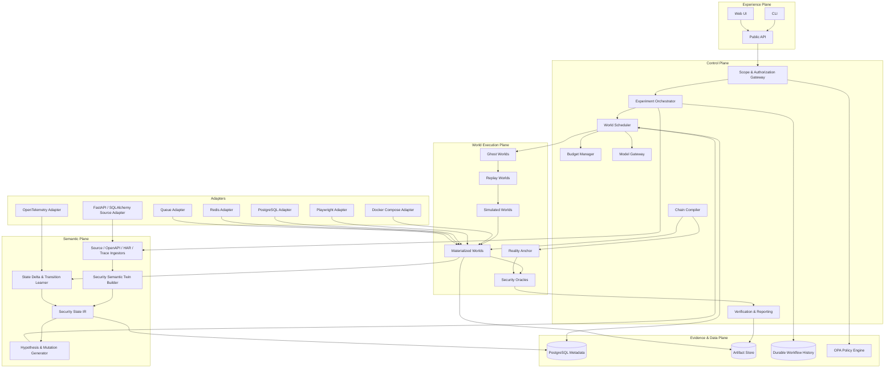
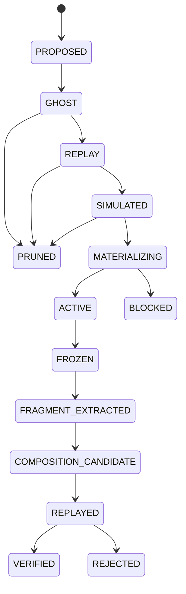

# StateWeaver：Reality-Tethered Security Multiverse

> 文件狀態：Architecture Baseline v1  
> 專案性質：授權環境、可控靶場與自有系統之安全研究工具  
> 核心命題：Fork security states, not just agent conversations.

---

## 0. 一頁結論

StateWeaver 不是「更長回合、更多工具、更多 Agent」的 VulnClaw 類型系統。它新增的核心計算原語是：

1. **Security Semantic Twin**：從原始碼、OpenAPI、HTTP 流量、瀏覽器操作、分散式 Trace、DB／Cache／Queue 狀態，建立局部且附帶證據與不確定性的安全語義分身。
2. **Tiered World Engine**：世界不是一律啟動完整容器，而分成 Ghost、Replay、Simulated、Materialized 四層，逐級升級成本。
3. **Security State DAG**：系統的主資料結構不是聊天紀錄，而是可分叉、去重、回溯的安全狀態圖。
4. **Transition Fragment**：每個局部發現都被編譯成「前置條件 → 動作 → 效果 → 證據」，不保留成散亂文字結論。
5. **Chain Compiler**：把多個局部發現合成一條從乾淨狀態可實際建立的攻擊鏈；不是合併容器快照。
6. **Reality Anchor**：所有高可信 Finding 最後都必須回到真實程式、Staging 或授權目標做最小化重播。
7. **StateChainBench**：用同模型、同工具、同 token、同時間與同請求預算，證明它在狀態依賴、組合型漏洞上優於線性 Agent。

首版只官方支援一條垂直技術棧：

```text
Docker Compose
+ FastAPI / SQLAlchemy
+ PostgreSQL
+ Redis
+ Celery（或相同語義的背景 Queue）
+ Playwright Browser
+ OpenTelemetry
```

泛用 HTTP 黑箱模式可以存在，但首版的「高保真分身」保證只適用於上述 Source-backed 技術棧。

---

## 1. 產品定義

### 1.1 產品定位

StateWeaver 是一個：

> 與真實系統持續校準、可分叉安全狀態、可探索反事實條件、可合成多條件攻擊鏈，並能回到現實重播驗證的安全研究引擎。

它不承諾：

- 一鍵攻擊任意網際網路目標。
- 自動完整複製任意企業系統。
- 支援所有技術棧、內網、AD、IoT、Mobile、ICS。
- 以 LLM 的文字判斷取代安全證據。
- 自動執行未經核准的破壞性操作。

### 1.2 可以公開驗證的核心宣稱

首版只應宣稱：

> 在相同資源預算下，StateWeaver 對需要多個身分、Session、資源所有權、Cache、Queue 或時序條件共同成立的 Web SaaS 漏洞，能比線性 Agent 更系統性地探索、合成與重播完整安全違反路徑。

在沒有公開實驗結果前，不宣稱「找到零日漏洞」或「全面超越所有自動滲透工具」。

### 1.3 成功定義

v1 完成不是「模組很多」，而是下列垂直流程全部成立：

```text
真實程式啟動
→ Baseline Capture
→ Security Semantic Twin
→ 產生 20–50 個 Ghost Worlds
→ 升級少數 Replay / Simulated Worlds
→ 實體化 3–5 個 Materialized Worlds
→ 找到至少三個局部條件
→ Chain Compiler 合成完整路徑
→ 從乾淨 Root World 重播成功
→ 在修復版本重播失敗
→ 輸出 Reality Proof Bundle
→ 與線性 Agent 做同預算比較
```

---

## 2. 不可退讓的架構原則

### 2.1 State-first，不是 Chat-first

聊天歷史只屬於模型介面，不是系統狀態。真正的系統紀錄是：

```text
World State
Transition
Observation
Evidence
Oracle Result
Replay Plan
```

### 2.2 Partial but honest twin

不追求完整 Digital Twin。每個事實與轉換都必須標示：

```text
OBSERVED      由實際 Trace／流量／狀態差分取得
INFERRED      由多個觀察推導
HYPOTHESIZED  模型提出、尚未校準
MOCKED        外部依賴被模擬
UNKNOWN       系統尚無足夠資訊
```

### 2.3 Reality is the final oracle

模型、模擬器與分身都只能產生候選結果。正式 Finding 的最高狀態必須來自真實程式或授權 Staging 的重播。

### 2.4 Typed actions only

LLM 不得直接取得任意 Shell。模型只能提出符合 JSON Schema 的 `ActionEnvelope`；執行前經過 Scope Policy、能力檢查、風險評級、預算檢查與必要的人審。

### 2.5 Worlds are promoted, not all materialized

建立 100 個世界，不代表啟動 100 套環境。只有高價值世界才逐級升級。

### 2.6 Snapshot 不 Merge；Transition 才 Compose

不同世界的 DB／Container Snapshot 不能粗暴合併。局部發現必須先轉換成 Transition Fragment，再由 Chain Compiler 從共同 Root 狀態重新合成。

### 2.7 Benchmark 與產品同時開發

沒有同預算對照實驗，系統就不能證明代差。StateChainBench 不是尾端文件工作，而是核心套件。

---

## 3. 系統全景



---

## 4. 五個平面

## 4.1 Experience Plane

### CLI

CLI 是首版主要操作面，必須先於 Web UI 完成。

```bash
stateweaver init
stateweaver target add --mode source-backed --repo ./lab
stateweaver scope validate scope.yaml
stateweaver baseline capture TARGET_ID
stateweaver twin build TARGET_ID
stateweaver experiment run experiment.yaml
stateweaver world tree RUN_ID
stateweaver world inspect WORLD_ID
stateweaver chain compile RUN_ID
stateweaver replay CHAIN_ID --anchor materialized
stateweaver compare --base vulnerable --candidate patched
stateweaver benchmark run statechainbench
```

### Web UI

首版 UI 只做四個工作區：

1. Experiment Overview
2. World DAG
3. Twin Inspector
4. Replay / Evidence Viewer

不要先做聊天式主介面。聊天可以存在，但不是主畫面。

---

## 4.2 Control Plane

### Scope & Authorization Gateway

所有動作都先通過 Policy Engine。Policy Input 至少包含：

```yaml
experiment_id: exp_123
world_id: world_045
target_id: target_demo
environment_mode: source_backed
action:
  type: http.request
  method: POST
  path: /api/roles/change
risk_class: state_change
requested_by: model:hypothesis-generator
budget_remaining:
  requests: 120
  materialized_worlds: 2
scope:
  hosts: [lab.local]
  allowed_actions: [read, test_account_write, cache_delay]
  denied_actions: [dos, persistence, credential_exfiltration]
```

Policy Result：

```yaml
decision: REQUIRE_APPROVAL
reason_codes:
  - STATE_CHANGING_REALITY_ACTION
constraints:
  max_requests: 3
  require_test_identity: true
  require_snapshot: true
```

### Experiment Orchestrator

建議用 durable workflow runtime。核心 Workflow：

```text
ExperimentWorkflow
├─ IntakeAndScopeWorkflow
├─ BaselineCaptureWorkflow
├─ TwinBuildWorkflow
├─ SearchWorkflow
│  └─ WorldLifecycleWorkflow × N
├─ ChainCompileWorkflow
├─ RealityReplayWorkflow
└─ ReportWorkflow
```

外部呼叫、模型請求、Docker 操作、HTTP 請求與 Snapshot 全部是 Activity；Workflow 本身只維護確定性狀態機。

### Budget Manager

預算不是執行後統計，而是執行前的強制門檻。

```yaml
budget:
  llm:
    max_calls: 40
    max_input_tokens: 250000
    max_output_tokens: 50000
  worlds:
    max_ghost: 64
    max_replay: 16
    max_simulated: 8
    max_materialized: 4
    max_concurrent_materialized: 2
  target:
    max_requests: 500
    max_write_requests: 30
    requests_per_second: 2
  runtime:
    max_action_seconds: 60
    max_world_cpu_seconds: 1800
```

每個消耗記入不可逆 Budget Ledger。

### Model Gateway

LLM 只負責四種工作：

```text
Hypothesis generation
Semantic labeling
Search critique
Human-readable explanation
```

模型不得直接：

```text
執行 Shell
修改 Scope
讀取原始 Secret
宣告 Finding 已確認
跳過 Policy Engine
```

Gateway 要求 JSON Schema、Prompt Version、Model ID、採樣參數、輸入 Hash 與輸出 Hash。Target 內容一律標記為 `UNTRUSTED_OBSERVATION`，不能和系統指令混合。

---

## 4.3 Semantic Plane

### Ingestors

首版資料來源：

| 來源 | 產出 |
|---|---|
| Docker Compose | 服務、網路、依賴、映像 Digest |
| OpenAPI | Endpoint、Method、Schema、Auth Requirement |
| FastAPI / SQLAlchemy Source | Route、Middleware、ORM Resource、可能的 Policy Check |
| Browser Trace / HAR | 使用者動作、Cookie、Token、前後端流程 |
| OpenTelemetry | 跨服務 Trace、DB／Cache／Queue 因果關聯 |
| PostgreSQL Schema / Snapshot | Resource、Ownership、Tenant、狀態差分 |
| Redis Snapshot / Key Sampling | Cache Key、Policy Version、Session Generation |
| Queue Events | Deferred Transition、Retry、Delay、Order |

### Security State IR

核心 IR 不理解 FastAPI、Redis 或 Celery 的品牌名稱；它只理解安全語義。

#### Entity

```text
Principal
Role
Tenant
Credential
Session
Resource
Policy
CacheEntry
QueueJob
FeatureFlag
Service
Endpoint
ExternalDependency
```

#### Relation

```text
member_of
acts_as
owns
belongs_to
authorized_by
cached_as
issued_from
references
pending_transition
controlled_by
visible_to
```

#### Fact

```yaml
fact_id: fact_001
subject: session:s_17
predicate: issued_role
object: role:editor
valid_from: 2026-07-29T12:00:00Z
valid_to: null
provenance:
  kind: observed
  evidence_ids: [ev_trace_17, ev_db_04]
confidence: 0.97
taint: trusted_runtime
```

### Transition Fragment

```yaml
transition_id: tr_stale_auth_cache
name: stale authorization cache after role downgrade
source: observed
preconditions:
  all:
    - principal.role == "viewer"
    - session.token_role == "editor"
    - cache.policy_generation < policy.current_generation
    - resource.tenant != principal.tenant
action:
  type: http.request
  template_ref: req_read_document
effects:
  - capability.add: read_foreign_tenant_resource
observables:
  - response.status == 200
  - response.body.owner_tenant != principal.tenant
  - db.audit_log.authorization_role == "editor"
evidence_ids:
  - ev_http_812
  - ev_trace_441
  - ev_redis_031
fidelity:
  code: exact
  identity: exact
  database: exact
  cache: observed
  queue: partial
  timing: partial
```

### Twin Builder

Twin Builder 流程：

```text
Static candidates
+ Dynamic baseline traces
+ Before/after state snapshots
→ Entity resolution
→ State facts
→ Transition candidates
→ Cross-source agreement
→ Uncertainty assignment
→ Security Semantic Twin
```

關鍵規則：

- 模型可以命名與解釋 Transition，但不能創造「Observed」證據。
- 同一 Transition 至少兩次重播一致，才從 `HYPOTHESIZED` 升到 `INFERRED`。
- 有 Runtime Trace 與可驗證 State Delta，才升到 `OBSERVED`。
- Source 與 Runtime 不一致時建立 `MODEL_DIVERGENCE`，不得靜默選邊。

### Active Calibration

Twin 不夠確定時，由 Scheduler 選擇資訊價值最高的低風險校準實驗：

```text
未知：Role downgrade 後 Redis 何時失效
→ 建立測試帳號
→ 降級角色
→ 以固定間隔讀取授權結果
→ 收集 Trace / Redis / DB 差分
→ 更新 Transition Timing Distribution
```

---

## 4.4 World Execution Plane

### 四層世界

| 層級 | 內容 | 主要用途 | 成本 |
|---|---|---|---:|
| Ghost | 純 IR、假設、前置條件與預期效果 | 大量枚舉與剪枝 | 極低 |
| Replay | 對既有 HAR／Trace／請求序列做參數、身分與順序變異 | 排除不可達路徑 | 低 |
| Simulated | 在 Semantic Twin 中執行 Transition | 計算條件組合與鏈可達性 | 中 |
| Materialized | 真正啟動 Compose、DB、Redis、Queue、Browser | 實際驗證 | 高 |

### World Manifest

```yaml
world_id: world_023
parent_world_id: world_004
root_snapshot_id: snap_root_01
tier: materialized
hypothesis_id: hyp_cache_role_mismatch
state_fingerprint: sha256:...
seed: 982341
clock:
  mode: controlled
  epoch: 2026-07-29T00:00:00Z
capabilities:
  postgres_restore: true
  redis_restore: true
  queue_reseed: true
  browser_session_fork: true
  timing_control: partial
snapshots:
  filesystem: fs_22
  postgres: pg_22
  redis: redis_22
  queue: queue_22
  browser: browser_22
lineage:
  transitions: [tr_01, tr_09, tr_14]
status: ACTIVE
```

### World Lifecycle



### Snapshot Strategy

首版不要追求 VM Snapshot。採多層策略：

```text
Application image：immutable digest
Filesystem：Container layer / controlled volume copy
PostgreSQL：小資料集 pg_dump/restore；較大資料集 base backup / clone strategy
Redis：RDB/AOF 或限定 Keyspace export/import
Queue：drain + deterministic export + reseed
Browser：Playwright storage state + trace + HAR
Configuration：environment manifest + secret handles
Clock：可注入 application clock；無法控制時標示 partial
```

### Isolation Invariants

每個 Materialized World 必須滿足：

```text
獨立 Docker network
獨立 DB namespace 或 instance
獨立 Redis namespace 或 instance
獨立 Queue namespace
獨立測試帳號與 Secret handles
CPU / Memory / PID / request quotas
無 Host filesystem write mount
無任意 Internet egress
```

Sibling contamination test 是 Adapter Conformance Suite 的必測項。

### State Fingerprint 與去重

Fingerprint 不 Hash 全部資料，而 Hash 安全相關 Canonical State：

```text
Principal / Role / Tenant
Credential / Session generation
Resource ownership / visibility
Policy generation
Cache generation
Pending jobs
Feature flags
Capabilities obtained
Controlled time bucket
```

兩條路徑若抵達相同 Fingerprint，Scheduler 合併探索節點，但保留不同 lineage 作為證據。

---

## 4.5 Evidence & Data Plane

### 資料儲存

| 類型 | 儲存 |
|---|---|
| Metadata / State DAG / Budget / Findings | PostgreSQL |
| HAR、Trace、DB Diff、Redis Diff、Screenshots、Reports | S3-compatible Artifact Store |
| Durable Workflow History | Temporal backend |
| Policy | OPA bundles / versioned Rego |
| Secrets | OS keyring 或外部 Vault；DB 只存 handle |

首版不使用 Neo4j。State DAG 以 PostgreSQL adjacency table、JSONB 與 recursive query 完成；證明需求後才考慮專用 Graph DB。

### Evidence Record

```yaml
evidence_id: ev_http_812
kind: http_exchange
artifact_uri: s3://artifacts/exp_1/world_23/http_812.json
sha256: ...
produced_by:
  adapter: playwright-http
  version: 0.1.0
trace_context:
  trace_id: ...
  span_id: ...
redaction_policy_version: policy_07
taint: untrusted_target_content
created_at: ...
```

所有 Artifact Content-addressed，報告引用 Hash，不引用會變動的臨時路徑。

---

## 5. 核心資料契約

## 5.1 Scope Manifest

```yaml
apiVersion: stateweaver.io/v1
kind: ScopeManifest
metadata:
  name: local-saas-lab
spec:
  environmentMode: source-backed
  targets:
    include:
      - host: app.local
        ports: [443]
        paths: ["/api/**"]
    exclude:
      - path: "/admin/destructive/**"
  identities:
    allowed:
      - test_user_a
      - test_user_b
      - test_admin
  actions:
    allow:
      - passive_observation
      - test_account_write
      - session_rotation
      - cache_delay
      - queue_reorder
    requireApproval:
      - concurrency_test
      - file_upload_test
    deny:
      - denial_of_service
      - persistence
      - credential_exfiltration
      - destructive_data_delete
  limits:
    requestsPerSecond: 2
    concurrentMaterializedWorlds: 2
    maxWriteRequests: 30
  validity:
    expiresAt: 2026-08-31T23:59:59Z
```

## 5.2 Action Envelope

```yaml
action_id: act_091
experiment_id: exp_01
world_id: world_23
action_type: session.rotate
parameters:
  identity_handle: identity:test_user_a
preconditions:
  - world.status == ACTIVE
expected_effects:
  - session.generation += 1
risk_class: reversible_state_change
idempotency_key: sha256:...
requested_by:
  type: model
  role: hypothesis_generator
policy_decision_ref: decision_882
```

## 5.3 Hypothesis

```yaml
hypothesis_id: hyp_44
claim: role downgrade may leave a stale cached authorization decision
required_facts:
  - role_changed
  - existing_session_preserved
  - cache_generation_lags_policy
predicted_boundary:
  type: tenant_isolation
novelty_score: 0.83
information_gain: 0.76
estimated_cost:
  llm_calls: 1
  target_requests: 8
  materialized_worlds: 1
suggested_mutations:
  - role.downgrade
  - cache.delay_invalidation
  - session.reuse
status: PROPOSED
```

## 5.4 Oracle Result

```yaml
oracle_result_id: oracle_77
oracle_type: tenant_isolation
world_id: world_23
invariant:
  actor.tenant == resource.tenant OR response.must_not_include(resource.secret_fields)
result: VIOLATED
observed:
  actor_tenant: tenant_a
  resource_tenant: tenant_b
  response_status: 200
  leaked_fields: [document_body]
evidence_ids: [ev_http_812, ev_db_991]
deterministic: true
```

## 5.5 Finding

```yaml
finding_id: finding_01
title: stale authorization cache enables cross-tenant document read
status: REALITY_REPLAYED
chain_id: chain_09
oracle_result_ids: [oracle_77]
fidelity:
  code: exact
  database: exact
  cache: exact
  queue: partial
  timing: observed
negative_controls:
  - fresh_session_after_downgrade: blocked
  - same_tenant_resource: expected_access
patched_version:
  replay_result: BLOCKED_BY_FIX
```

---

## 6. Search Controller

### 6.1 搜尋策略

首版不直接實作複雜演化演算法。預設使用「分層 Best-first Beam Search」：

```text
LLM 提出少量高品質 Hypotheses
→ Deterministic Mutator 展開變異
→ Ghost 層做可達性與重複狀態剪枝
→ Replay 層排除參數／順序不成立者
→ Simulated 層估算安全邊界距離
→ 最高分少數世界 Materialize
→ 新觀察回饋 Twin 與 Frontier
```

Search Policy 是可插拔介面：

```text
BeamSearchPolicy       v1 default
MCTSPolicy             experimental
EvolutionaryPolicy     roadmap
HumanSteeredPolicy     supported
```

### 6.2 世界評分

```text
priority =
  boundary_impact
× information_gain
× novelty
× composability
× fidelity
× reachability
÷ normalized_cost
÷ operational_risk
```

不能只用 LLM 自評。各欄位來源：

| 分數 | 來源 |
|---|---|
| boundary impact | Oracle taxonomy |
| information gain | Twin uncertainty reduction |
| novelty | State fingerprint distance |
| composability | 與既有 Transition precondition/effect 的連接數 |
| fidelity | Evidence vector |
| reachability | Planner estimate |
| cost | Budget ledger |
| operational risk | Policy engine |

### 6.3 剪枝規則

```text
OUT_OF_SCOPE
DUPLICATE_STATE
DOMINATED_BY_CHEAPER_WORLD
NO_NEW_FACTS
LOW_FIDELITY_WITHOUT_CALIBRATION_PATH
UNSUPPORTED_ADAPTER_CAPABILITY
BUDGET_EXCEEDED
NON_REVERSIBLE_ACTION_NOT_APPROVED
REPEATED_NONDETERMINISM
```

### 6.4 Promotion Gate

世界升級到 Materialized 前必須具備：

```text
可執行 Action Plan
所有 Action 通過 Policy
存在明確預期 Observation
至少一個 Machine-checkable Oracle
Snapshot capability 可用
成本在剩餘預算內
```

---

## 7. Mutation Engine

Mutation Engine 是確定性程式，不靠 LLM逐個產生請求。

首版 Mutation Family：

| Family | 例子 |
|---|---|
| Identity | 使用者、角色、Tenant、Impersonation Context |
| Session | Token generation、Refresh、Reuse、Logout、Expiry window |
| Resource | Ownership、Reference、Visibility、Lifecycle state |
| Policy | Policy version、Role transition、Feature flag |
| Cache | Invalidation delay、stale generation、node divergence |
| Queue | Delay、retry、duplicate、reorder、partial completion |
| Sequence | 重排、重播、跳步、重複提交 |
| Timing | Barrier、controlled delay、concurrent request |
| Dependency | Mock response class、timeout、retryable error |

每個 Mutation 必須宣告：

```text
required capabilities
risk class
reversibility
expected state delta
cleanup procedure
```

---

## 8. Chain Compiler

### 8.1 輸入

Chain Compiler 接收：

```text
Root State
Transition Fragments
Desired Oracle Violation
Scope / Risk Constraints
Environment Capabilities
```

### 8.2 中介表示

```yaml
fragment:
  id: tr_cache_stale
  preconditions:
    role_changed: true
    session_generation: old
  effects:
    cache_generation: old
  action_ref: cache.delay_invalidation
  temporal_constraints:
    - action must occur before session.refresh
```

### 8.3 合成

首版採用兩階段：

1. **Graph reachability**：快速排除無法連接的 Fragment。
2. **Constraint solving / planning**：處理前置條件、效果、互斥條件、時序與能力限制。

輸出不是 Finding，而是 `Candidate Replay Plan`：

```yaml
chain_id: chain_09
root_snapshot: snap_root_01
steps:
  - create_test_user_a
  - login_and_capture_session_v3
  - downgrade_role_to_viewer
  - delay_cache_invalidation
  - discover_foreign_resource_reference
  - request_resource_with_session_v3
expected_terminal_predicate:
  - can_read_foreign_tenant_resource == true
```

### 8.4 Chain Validation

Candidate Plan 必須經過：

```text
Simulated execution
→ Materialized clean-room replay
→ Step minimization
→ Negative controls
→ Reality Anchor replay
→ Patched-version replay
```

### 8.5 Chain Minimizer

使用 delta-debugging 概念逐步移除條件：

```text
拿掉 cache delay 是否仍成功？
拿掉 old session 是否仍成功？
改成 same-tenant resource 是否仍成功？
改用 fresh token 是否仍成功？
```

最終報告要能證明每個條件是否必要，而不是只展示一條偶然成功的長序列。

---

## 9. Reality Anchor

### 9.1 三種模式

| Mode | 可做事情 | 保真度上限 |
|---|---|---|
| URL-only | Client session、HTTP sequence、browser state、低風險校準 | Server state unknown |
| Connected Staging | 測試帳號、Trace、DB／Cache／Queue adapter、有限 Snapshot | High |
| Source-backed | 真實程式 Build、完整 Compose、Instrumentation、可重建狀態 | Highest for supported stack |

### 9.2 Reality Replay Broker

所有 Reality 操作經過專用 Broker：

```text
Scope check
Rate limit
Identity restriction
Write quota
Action risk check
Approval gate
Request execution
Trace collection
State delta collection
Cleanup
```

### 9.3 結果分級

```text
SPECULATIVE
CALIBRATED
SIMULATED_REACHABLE
SHADOW_REPRODUCED
REALITY_REPLAYED
PATCH_VERIFIED
REJECTED
BLOCKED
MODEL_DIVERGENCE
NONDETERMINISTIC
```

只有 `REALITY_REPLAYED` 與 `PATCH_VERIFIED` 可以進入正式 Confirmed Finding 區。

---

## 10. Security Oracles

Oracle 不由 LLM自由判斷，而由程式或 Policy 定義。

### 10.1 Oracle 類型

```text
Authorization Oracle
Tenant Isolation Oracle
Workflow State Machine Oracle
Idempotency Oracle
Confidentiality Oracle
Integrity Oracle
Session Revocation Oracle
Cache Coherence Oracle
Queue Consistency Oracle
```

### 10.2 實作來源

| Oracle | 實作 |
|---|---|
| Policy-based | Rego |
| DB state | SQL predicate |
| HTTP differential | Response schema / field / status comparison |
| Runtime | Trace span attribute / service decision |
| Application hook | Test-only assertion endpoint |
| Human | Manual verdict，不能單獨升級為 Confirmed |

### 10.3 Oracle Contract

```python
class SecurityOracle(Protocol):
    id: str
    version: str

    async def evaluate(
        self,
        before: SecurityState,
        action: ActionEnvelope,
        after: SecurityState,
        observations: list[Observation],
    ) -> OracleResult: ...
```

---

## 11. Adapter Architecture

核心不得 import 具體技術棧實作。所有外部系統透過 Port / Adapter。

```python
class EnvironmentAdapter(Protocol):
    async def prepare(self, target: TargetSpec) -> EnvironmentHandle: ...
    async def snapshot(self, env: EnvironmentHandle) -> SnapshotManifest: ...
    async def fork(self, snapshot: SnapshotManifest) -> EnvironmentHandle: ...
    async def restore(self, env: EnvironmentHandle, snapshot: SnapshotManifest) -> None: ...
    async def destroy(self, env: EnvironmentHandle) -> None: ...
    def capabilities(self) -> CapabilityManifest: ...


class ActionExecutor(Protocol):
    async def validate(self, action: ActionEnvelope) -> ValidationResult: ...
    async def execute(self, action: ActionEnvelope, env: EnvironmentHandle) -> ObservationSet: ...


class StateProvider(Protocol):
    async def capture(self, env: EnvironmentHandle) -> RawStateArtifact: ...
    async def normalize(self, raw: RawStateArtifact) -> list[Fact]: ...


class SourceExtractor(Protocol):
    async def extract(self, source: SourceArtifact) -> list[Entity | Fact | TransitionCandidate]: ...
```

### Capability Manifest

```yaml
adapter: docker-compose-fastapi
version: 0.1.0
capabilities:
  filesystem_fork: true
  postgres_snapshot: true
  redis_snapshot: true
  queue_snapshot: true
  browser_session_fork: true
  distributed_trace: true
  controlled_clock: partial
  concurrency_barrier: true
  network_fault_injection: experimental
```

### Conformance Suite

每個 Environment Adapter 必須通過：

```text
snapshot_restore_identity
sibling_world_isolation
cleanup_after_failure
idempotent_destroy
secret_redaction
network_egress_enforcement
timeout_cancellation
replay_from_root
state_fingerprint_stability
adapter_version_pinning
```

---

## 12. 平台自身的 Threat Model

### 12.1 主要威脅

```text
Target 網頁／README／API 回傳 Prompt Injection
惡意或被污染的 Adapter / Plugin
LLM Provider 看見 Secret
跨世界資料污染
模型自行擴大 Scope
高併發造成目標 DoS
Artifact 中含敏感資料
Replay 不確定性導致假確認
Benchmark 被 Agent 作弊
```

### 12.2 防護

| 威脅 | 防護 |
|---|---|
| Prompt Injection | Target 內容進 `UNTRUSTED_OBSERVATION`，永不成為指令；模型不能修改 Policy |
| 惡意 Adapter | Capability sandbox、版本 Pin、Conformance Suite、可選簽章 |
| Secret 洩漏 | Secret handle、欄位級 redaction、Model Gateway 隔離 |
| Cross-world contamination | 獨立 namespace、network、storage、identity；污染測試 |
| Scope expansion | OPA 以 server-side policy 決策；LLM 無權改 Scope |
| DoS | request rate、CPU/memory、concurrency、time budget |
| 敏感 Artifact | 加密、Retention policy、redaction manifest |
| 假確認 | deterministic oracle、clean-room replay、negative controls |
| Benchmark gaming | hidden oracle、variant generation、holdout families、source visibility tracks |

### 12.3 公開版本的硬邊界

預設公開版本：

```text
只允許 localhost、私有 Lab、明確 allowlist
不提供隱匿、持久化、橫向移動、憑證外洩與 DoS 模組
真實環境 state-changing action 預設 require approval
外部網路 egress 預設 deny
```

---

## 13. 技術棧凍結

### 13.1 Backend

```text
Python
FastAPI
Pydantic
SQLAlchemy / Alembic
Temporal Python SDK
PostgreSQL
S3-compatible object storage（本機 MinIO）
OPA sidecar
OpenTelemetry SDK / Collector
Playwright
```

### 13.2 Frontend

```text
TypeScript
React
Vite 或 Next.js
React Flow / Cytoscape 類型圖形元件
```

### 13.3 Solver

```text
Graph reachability
+ SMT / Constraint solver adapter
```

Solver 也透過介面，避免核心永久綁定單一實作。

### 13.4 不在 v1 引入

```text
Kubernetes
Neo4j
Kafka
Rust / Go sidecar
多模型競技
分散式跨主機 World Cluster
完整 Plugin Marketplace
```

除非實際效能或隔離需求證明必要，否則不增加基礎設施種類。

---

## 14. Database Schema

核心資料表：

```text
targets
target_versions
scope_manifests
experiments
experiment_runs
workflow_refs
world_nodes
world_edges
world_snapshots
state_facts
state_relations
transition_fragments
hypotheses
actions
observations
evidence_artifacts
oracle_definitions
oracle_results
candidate_chains
replay_runs
findings
budget_ledger
adapter_registry
capability_manifests
policy_decisions
approvals
```

重要約束：

```text
world_nodes.state_fingerprint + experiment_run_id unique
all action execution requires policy_decision_id
all confirmed findings require successful replay_run_id
all artifacts require sha256
all snapshots pin target version and adapter versions
```

---

## 15. Event Model

```text
experiment.created
scope.validated
baseline.capture.started
baseline.capture.completed
twin.fact.upserted
twin.transition.learned
twin.divergence.detected
hypothesis.proposed
world.forked
world.promoted
world.pruned
world.materialization.started
world.materialization.completed
action.proposed
action.authorized
action.executed
observation.captured
oracle.violated
fragment.extracted
chain.compiled
replay.started
replay.completed
finding.verified
finding.rejected
patch.replay.completed
```

每個事件至少帶：

```text
experiment_id
run_id
world_id（若適用）
actor
trace_id
schema_version
timestamp
payload_hash
```

---

## 16. API Surface

### Targets

```text
POST   /v1/targets
GET    /v1/targets/{id}
POST   /v1/targets/{id}/baseline
POST   /v1/targets/{id}/twin
```

### Experiments

```text
POST   /v1/experiments
POST   /v1/experiments/{id}/run
GET    /v1/experiments/{id}/status
POST   /v1/experiments/{id}/cancel
```

### Worlds

```text
GET    /v1/runs/{id}/worlds
GET    /v1/worlds/{id}
POST   /v1/worlds/{id}/promote
POST   /v1/worlds/{id}/replay
POST   /v1/worlds/{id}/prune
```

### Chains / Findings

```text
POST   /v1/runs/{id}/chains/compile
GET    /v1/chains/{id}
POST   /v1/chains/{id}/replay
GET    /v1/findings/{id}
GET    /v1/findings/{id}/bundle
```

### Approvals

```text
GET    /v1/approvals/pending
POST   /v1/approvals/{id}/approve
POST   /v1/approvals/{id}/reject
```

---

## 17. Reality Proof Bundle

每個正式 Finding 輸出：

```text
finding.json
scope.yaml
target.lock
adapter.lock
root-state.json
semantic-twin-slice.json
transition-fragments/
chain.plan.json
replay.har
replay.trace.otlp
http-exchanges/
db-diff.json
redis-diff.json
queue-diff.json
oracle-results.json
negative-controls.json
patched-version-replay.json
report.md
artifact-manifest.sha256
```

報告頁面可從任一步驟回到原始 Artifact，不能只顯示模型摘要。

---

## 18. StateChainBench

### 18.1 Benchmark 目的

StateChainBench 專門測：

```text
單一步驟不是漏洞
單一條件不是漏洞
至少三個狀態條件共同成立
特定順序或時序必要
存在干擾路徑
終點由 Machine-checkable Oracle 判定
```

### 18.2 Track

```text
Black-box Track       只有 URL 與測試帳號
Gray-box Track        URL + OpenAPI + HAR
Source-backed Track   Repo + Compose + Instrumentation
```

### 18.3 Challenge 結構

```text
challenge/
├─ compose.yaml
├─ app/
├─ seed/
├─ scope.yaml
├─ challenge.public.json
├─ variants/
├─ evaluator-hidden/
│  └─ oracle.py
└─ patched/
```

### 18.4 類別

```text
Session revocation + stale cache
Tenant boundary + object reference + old token
Queue retry + duplicate transaction + role transition
Feature flag + historic session + service version skew
Asynchronous permission propagation
Multi-node cache inconsistency
Request ordering + workflow state bypass
```

### 18.5 防背題

```text
隨機化路徑、參數、Tenant、ID、角色名稱
挑戰模板與實例分離
Hidden oracle
Holdout vulnerability families
禁止把 evaluator/source 暴露給 black-box agent
同一模板產生多個變體
```

### 18.6 Baseline

```text
Linear ReAct Agent
VulnClaw-style model-led loop adapter
Tree planner without executable worlds
StateWeaver without Chain Compiler
StateWeaver full
Human + StateWeaver
```

### 18.7 指標

```text
Complete-chain success rate
Reality replay success rate
False-positive rate
Verified finding per token
Verified finding per target request
Materialized worlds per success
Wall-clock time
Human intervention minutes
Policy violation count
Replay determinism rate
Chain minimality
```

### 18.8 Ablation

```text
拿掉 Semantic Twin
拿掉 World tiers
拿掉 State fingerprint dedup
拿掉 Chain Compiler
拿掉 Reality Anchor
拿掉 Budget-aware Scheduler
```

---

## 19. Repository Layout

```text
stateweaver/
├─ apps/
│  ├─ api/
│  ├─ cli/
│  └─ web/
├─ packages/
│  ├─ contracts/
│  ├─ domain/
│  ├─ state_ir/
│  ├─ policy/
│  ├─ evidence/
│  ├─ twin/
│  ├─ search/
│  ├─ mutations/
│  ├─ chain_compiler/
│  ├─ replay/
│  ├─ oracles/
│  ├─ reporting/
│  └─ model_gateway/
├─ workflows/
│  ├─ experiment/
│  ├─ baseline/
│  ├─ world/
│  ├─ replay/
│  └─ benchmark/
├─ adapters/
│  ├─ environments/docker_compose/
│  ├─ source/fastapi_sqlalchemy/
│  ├─ browser/playwright/
│  ├─ state/postgresql/
│  ├─ state/redis/
│  ├─ state/celery/
│  ├─ telemetry/opentelemetry/
│  └─ solver/
├─ benchmarks/
│  └─ statechainbench/
├─ labs/
│  └─ multitenant-saas/
├─ tests/
│  ├─ unit/
│  ├─ property/
│  ├─ integration/
│  ├─ conformance/
│  ├─ security/
│  └─ e2e/
├─ policies/
│  ├─ scope/
│  ├─ action/
│  └─ retention/
├─ docs/
│  ├─ architecture/
│  ├─ adr/
│  ├─ threat-model/
│  └─ benchmark/
├─ pyproject.toml
├─ compose.dev.yaml
├─ ARCHITECTURE.md
├─ THREAT_MODEL.md
├─ SECURITY.md
└─ ABUSE_POLICY.md
```

### Dependency Rule

```text
contracts / domain / state_ir
        ↑
policy / evidence / twin / search / compiler
        ↑
workflows / adapters
        ↑
apps
```

核心 domain 永遠不能反向 import Docker、FastAPI、Redis、Playwright 或特定模型 SDK。

---

## 20. 測試策略

### Unit

```text
IR validation
Fingerprint canonicalization
Budget accounting
Policy decision mapping
Transition precondition/effect evaluation
Chain constraint translation
```

### Property-based

```text
相同 root + seed + plan 應得到相同 fingerprint
同一 Action idempotency key 不得重複執行
Pruned world 不得再次被排程
Sibling world mutation 不得影響彼此
```

### Integration

```text
PostgreSQL snapshot / restore
Redis export / restore
Queue drain / reseed
Playwright session fork
OTel trace correlation
OPA decision enforcement
Temporal failure recovery
```

### Security

```text
Target prompt injection
Malicious tool output
Scope escalation request
Secret leakage to model
Cross-world contamination
Artifact path traversal
Adapter command injection
Approval bypass
```

### E2E

```text
vulnerable branch：完整鏈成功
patched branch：同鏈失敗
negative control：不成立
README clean machine reproduction：成功
```

---

## 21. 里程碑與退出條件

## M0：Contracts + Lab

交付：

```text
ScopeManifest
ActionEnvelope
Security State IR
Transition Fragment
World Manifest
Oracle Result
一個多租戶 SaaS Lab
一個 vulnerable branch
一個 patched branch
```

退出條件：Oracle 可在不使用 LLM 的情況下準確判定漏洞成立／不成立。

## M1：Deterministic Replay Kernel

交付：

```text
Root seed
Browser session capture
HTTP action log
DB / Redis / Queue state capture
Clean reset
Exact replay
```

退出條件：同一計畫連續重播結果穩定；失敗可定位到明確 Step。

## M2：Materialized World Engine

交付：

```text
Docker Compose Adapter
World fork / restore / destroy
Per-world namespace
State fingerprint
Sibling isolation tests
```

退出條件：至少四個 sibling worlds 並行且互不污染。

## M3：Security Semantic Twin

交付：

```text
OpenAPI ingest
FastAPI / SQLAlchemy extractor
OTel trace ingest
State delta learner
Fact provenance / fidelity
```

退出條件：能從一次實際使用者操作產生可驗證的 Transition Fragment。

## M4：Tiered Search Controller

交付：

```text
Hypothesis schema
Ghost / Replay / Simulated tiers
Beam frontier
Budget ledger
Promotion / prune gates
```

退出條件：能從 20+ Ghost worlds 中只升級少數世界，且保留真正有效條件。

## M5：Chain Compiler

交付：

```text
Fragment graph
Constraint translation
Candidate plan generation
Clean-room replay
Chain minimizer
```

退出條件：自動把至少三個分散條件合成可重播安全違反鏈。

## M6：Reality Anchor + Proof Bundle

交付：

```text
Reality Replay Broker
Negative controls
Patched-version replay
Finding status machine
Reality Proof Bundle
```

退出條件：Finding 可由另一台乾淨機器依 Bundle 重現。

## M7：StateChainBench

交付：

```text
Challenge generator
Hidden oracle
Baseline adapters
Equal-budget runner
Metrics / ablation report
```

退出條件：至少在一個 holdout challenge family 上，Full StateWeaver 明顯優於 linear baseline，而非只在已知 Lab 題目勝出。

## M8：Web UI + Public Release

退出條件：新使用者只看 README 能啟動 Lab、執行 Benchmark、打開 World DAG 並重播 Finding。

---

## 22. 第一個旗艦 Demo

建立一個多租戶文件 SaaS：

```text
User A：Tenant A editor
User B：Tenant B viewer
Admin：可降級角色
Redis：快取授權結果
Celery：非同步同步角色／權限
Token：帶角色 generation
Resource：文件屬於不同 Tenant
```

完整漏洞條件：

```text
先取得舊 Session
+ Admin 降級角色
+ Queue 延遲同步
+ Redis 保留舊 Policy generation
+ 取得另一 Tenant 的 resource reference
+ 在特定時間窗重播舊 Session
```

Decoys：

```text
一個回傳 200 但資料已遮罩的假 IDOR
一個只在 mock endpoint 出現的假權限錯誤
一個會被 fresh token 正確阻擋的近似路徑
```

預期展示：

```text
48 Ghost Worlds
12 Replay Worlds
6 Simulated Worlds
3 Materialized Worlds
3 Transition Fragments
1 Synthesized Chain
1 Reality-Replayed Finding
1 Patched-version Block
```

首頁 Demo 不播聊天內容，而顯示：

```text
Root State
→ World branching
→ Local discoveries
→ Chain compilation
→ Clean replay
→ Oracle violation
→ Patch comparison
```

---

## 23. 最重要的工程順序

正確順序：

```text
Lab / Oracle
→ Replay
→ Snapshot isolation
→ State IR
→ Transition extraction
→ Chain Compiler
→ Search Scheduler
→ LLM hypothesis generation
→ UI
```

錯誤順序：

```text
先做漂亮 Agent 對話
→ 接很多模型
→ 接很多工具
→ 最後才處理狀態與重播
```

LLM 必須最後接進核心閉環。先用人工定義 Hypothesis 驗證 World Engine 與 Chain Compiler；否則每次失敗都無法判斷是模型、狀態、Snapshot、Planner 還是 Oracle 的問題。

---

## 24. 凍結決策

以下決策在 v1 不再反覆更改：

1. 專案核心是 Security State DAG，不是 Agent conversation loop。
2. 世界採四層，不全部實體化。
3. 不合併 Snapshot，只合成 Transition。
4. LLM 只能產生 typed hypothesis / action proposal。
5. OPA 是所有動作的 server-side policy gate。
6. Temporal 管理長流程與失敗恢復。
7. PostgreSQL 同時保存 Metadata 與 DAG；不先引入 Graph DB。
8. OpenTelemetry 是 Source-backed 因果觀察主通道。
9. Docker Compose 是唯一官方 v1 Environment Adapter。
10. FastAPI / SQLAlchemy / PostgreSQL / Redis / Celery 是唯一高保真 v1 Stack。
11. Finding 必須有 deterministic oracle 與 clean-room replay。
12. StateChainBench 與產品一起發布。

---

## 25. 一句話架構

> StateWeaver 將真實應用的安全相關狀態抽象成附帶證據與不確定性的 Semantic Twin，利用分層 World Engine 在固定預算下探索反事實狀態，把局部發現編譯成可執行 Transition，透過 Chain Compiler 合成完整多條件攻擊鏈，最後回到真實程式或授權 Staging 以 deterministic Oracle 重播驗證。
