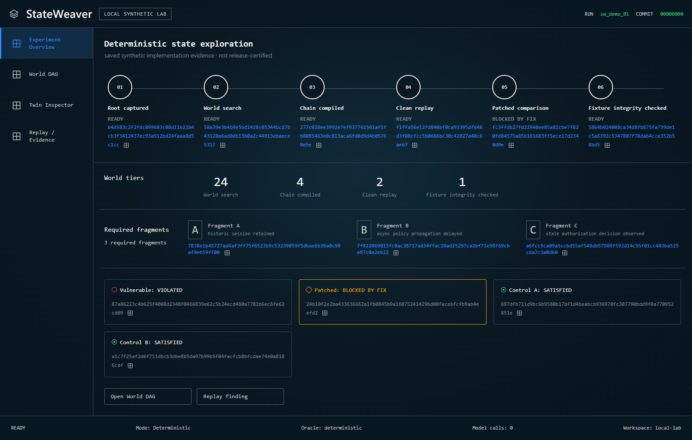

# StateWeaver

> Fork security states, not just agent conversations.



StateWeaver is a state-first security research engine for **authorized, reproducible labs**. It
builds evidence-backed security state, explores cheap counterfactual worlds, compiles local
transition fragments into a complete chain, and then returns to a clean reality anchor for a
deterministic verdict.

```text
Root state -> World DAG -> Local transitions -> Chain compiler
           -> Clean replay -> Oracle verdict -> Patched replay
```

## Why this is different

- **State before chat:** the durable record is facts, transitions, observations, evidence, and
  oracle results—not a transcript.
- **Tiered worlds:** Ghost, Replay, Simulated, and Materialized worlds spend real resources only
  when evidence justifies promotion.
- **Reality is the final oracle:** a model can propose a hypothesis; it cannot confirm a finding.
- **Transitions compose; snapshots do not:** chains are rebuilt from a common root and replayed.
- **Auditable evaluation:** StateChainBench binds its local dataset, evaluator, solver
  configuration, deterministic tariff, raw results, comparisons, and ablations while keeping
  public-benchmark claims behind a higher release bar.

## Current status

Architecture baseline v1 is being implemented milestone-by-milestone. The proof-producing M0/M1
foundation, M3 semantic-twin flow, and M4 offline search flow pass locally. M2 deliberately remains
partial: its content-backed six-component synthetic archive protocol passes emulator tests, but no
live Docker or real-provider snapshot proof exists. Per-world lifecycle gates now prove four-way
runner overlap without permitting same-world races. `WorldManager` linearizes snapshot, restore,
destroy, transition, and parent-fork admission per world, while monotonic revisions reject stale
commits. Pending world/environment reservations also close the pre-publication admission race:
duplicate or overlapping handles cannot reach snapshot or let a losing operation destroy the
winner, while cleanup failures remain quarantined. A single private store writer now owns all
lifecycle commits; the public world catalog is read-only, rejects metadata-only cleanup bypasses,
and binds asynchronous commands to one event loop. The opt-in live workflow remains unexecuted.
M5's synthetic authorization closure, M7's trusted-runner integrity, and M8's fixed API/browser
contract have been adversarially hardened and pass their local gates. They remain synthetic
prototypes, not release certification. M6 now has a fail-closed, content-addressed
`RealityReplayReceipt`: bare replay IDs and claimed outcomes can no longer promote a `Finding`.
The receipt binds scope/target/adapter locks, plan/root identity, repeated replay semantics,
observed Oracle violations, negative controls, patch comparison, and the evidence manifest. It is
an internal-coherence contract, not a Reality Broker signature or producer attestation. Its
pre-receipt manifest excludes the Finding, receipt, final publication report, and attestation to
avoid recursive identity. All consumers must revalidate serialized input rather than trust
unchecked in-memory model instances. Until a trusted broker/store resolver exists, the contract
rejects both reserved confirmed statuses even when a receipt is internally coherent. A narrow
synthetic-profile v2 resolver now snapshots caller-supplied artifact bytes exactly once and closes
manifest, role, digest, retained-plan/executed-envelope, Oracle, control, patch, and evidence-index
substitutions. It independently regenerates the complete replay-step event narrative for primary,
control, and patched lanes from each typed result/action log, requires patch root parity, and rejects
unrelated failure codes masquerading as `BLOCKED_BY_FIX`. The general event contract is also v2:
its domain-separated semantic hash binds all envelope metadata, while `EventHistory` verifies an
exact per-run hash chain. Negative controls now retain their own exact root artifact, require full
logical-root parity, and carry a V2 delta reconstructed from exact verified plan/root artifact
digests and deterministic result signatures; default-field omission, caller-authored state paths,
and delta-only coherent remints are rejected. The enum kind is still an explicitly unattested
producer label, not a proved mutation witness. These remain self-contained integrity checks, not
freshness or execution attestation. The resolver accepts no filesystem path or issuer assertion
and always returns a non-authoritative, non-promotable candidate; authenticated retention and
source/issuer trust remain open.

One horizontal local integration now preserves the same three TestClient/OTLP/state-delta
`OBSERVED` fragments through a 24 -> 4 -> 2 -> 1 in-memory search and Materialized-tier admission,
then compiles all three into a minimal typed chain. The bridge independently rebinds promotion,
state, evidence, Oracle, the replayed beam decision, provisional and committed budgets, the
capture-supplied compiler root, policy/approval, allocation world, terminal goal, envelope semantics,
and compiler output. Promotion events form a canonical `EventEnvelope`/`EventHistory` v2 lifecycle
reconstructed from the bound search batch, policy and result, input and committed ledgers, and committed promotions:
`search_blocked`; `reserved` -> `not_committed`; or `reserved` -> `allocated` -> `captured` ->
`committed`. This is an audit projection, not operational callback telemetry or a wall-clock
transcript. Releasing an uncommitted allocation is compensating cleanup, not a transactional rollback claim; the
self-contained history also has no external freshness attestation. The flow performs no external
I/O, and it does not turn the abstract allocation into a live materialized-provider, Twin-derived
ranking, executed replay, or release-certification claim.

| Milestone | Auditable local status | Evidence |
| --- | --- | --- |
| M0 Contracts + Lab | Foundation proof passes; release audit pending | `packages/contracts/`, `labs/multitenant-saas/` |
| M1 Deterministic Replay | Five-run clean-root differential passes | `packages/replay/`, `apps/cli/` |
| M2 World Engine | Archive + lifecycle authority/concurrency pass; live Docker/provider proof absent | `packages/worlds/`, `tests/integration/worlds/`, adapter `PARTIAL` |
| M3 Semantic Twin | Source + OTLP + state-delta flow and observed-fragment pipeline pass | `packages/twin/`, `tests/integration/twin/`, `tests/integration/pipeline/` |
| M4 Search | Offline 24 → 4 → 2 → 1 flow preserves the observed candidate | `packages/search/`, `workflows/world/`, `tests/integration/pipeline/` |
| M5 Chain Compiler | Three observed fragments cross the admission bridge; synthetic replay closure hardened | `packages/compiler/`, `tests/integration/compiler/`, `tests/integration/pipeline/` |
| M6 Reality + Proof | V2 event reconstruction + immutable-byte candidate resolver pass; trusted broker absent | `packages/contracts/`, `packages/evidence/`, `apps/cli/` |
| M7 StateChainBench | Trusted built-in synthetic runner hardened; not equal-work or public-certified | `benchmarks/statechainbench/` |
| M8 Public UX | Read-only fixed API + four-workspace client pass local contract/browser QA | `apps/api/`, `apps/web/` |

The current M7 numbers are retained only as a deterministic prototype observation. The runner
accepts only its two exact built-in solver types and closes dataset, evaluator, configuration,
ledger, comparison, and ablation provenance. It still runs in one process and uses a deterministic
tariff rather than equivalent measured compute, so the result is not an equal-work claim or a
public benchmark result.

## Local development

Prerequisites: Python 3.12+, [uv](https://docs.astral.sh/uv/), and Node.js 24 for the web workspace.
Docker Compose is required only for materialized-world integration tests.

```bash
uv sync --all-packages --group dev --locked
uv run stateweaver --json doctor
uv run stateweaver --json foundation verify
uv run stateweaver foundation collect-evidence --help
```

The read-only synthetic public workspace runs on two fixed loopback ports:

```bash
uv run uvicorn stateweaver_api.app:app --app-dir apps/api/src --host 127.0.0.1 --port 8000
cd apps/web && npm ci && npm run dev -- --host 127.0.0.1 --port 3000 --strictPort
```

`foundation verify` is the current clean-machine demo. It performs five vulnerable clean-root
replays, an identical-plan patched replay, and the negative-control matrix entirely in process.
It exits nonzero if the deterministic proof conditions are not met.

The CI path also retains a canonical proof bundle containing the exact five runs, patched replay,
negative controls, full typed action log, policy bindings, Oracle evidence, four JUnit reports, and
an exact-file SHA-256 manifest. `stateweaver foundation verify-evidence <run-directory>` validates
file integrity and causal coherence, then independently re-executes the installed fixed foundation
without executing bundle contents. The verifier hashes and parses one captured read of every file
and returns its `snapshot_sha256`; consumers must not reopen mutable paths and assume they are the
same snapshot. Main-branch CI is configured to sign the exact-file manifest
with GitHub OIDC provenance; see [proof verification](docs/PROOF_VERIFICATION.md).

For repository development:

```bash
uv run ruff format --check .
uv run ruff check .
uv run mypy packages adapters apps labs workflows benchmarks tests
uv run pytest
```

The lab is synthetic and process-local/localhost-only; the demo has no arbitrary-target or shell
execution path. Read [AGENTS.md](AGENTS.md), [SECURITY.md](SECURITY.md), and
[ABUSE_POLICY.md](ABUSE_POLICY.md) before adding adapters or actions.

## Public release bar

A StateWeaver finding is publishable only when the vulnerable build reproduces from a clean root,
the deterministic oracle reports the invariant violation, negative controls do not violate it,
and the same replay is blocked by the patched build. A revalidated `RealityReplayReceipt` is
necessary but deliberately insufficient for confirmed status; local synthetic results remain
`SYNTHETIC_REPRODUCED`. Every claim must link back to raw evidence. Until a Reality Replay Broker
resolves the receipt's digests against retained artifacts and authenticates its issuer,
`REALITY_REPLAYED` and `PATCH_VERIFIED` remain fail-closed and M6 is not certified.

Licensed under Apache-2.0.
